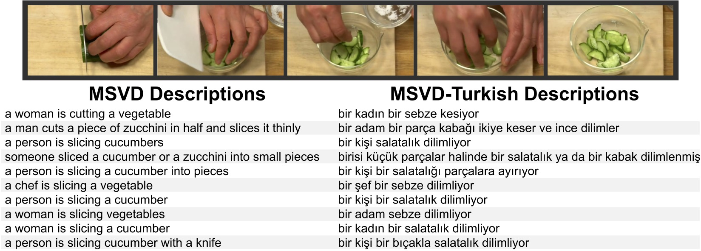

# Paper
Begum Citamak, Ozan Caglayan, Menekse Kuyu, Aykut Erdem, Erkut Erdem, Pranava Madhyastha, and Lucia Specia. "MSVD-Turkish: A Comprehensive Multimodal Dataset for Integrated Vision and Language Research in Turkish", submitted to Machine Translation Journal.
[pdf](MSVD_TR_NLE.pdf)

# MSVD-Turkish Dataset
This repo contains the first large scale video captioning dataset for Turkish languages, obtained by carefully translating the English descriptions of the videos in the [MSVD (Microsoft Research Video Description Corpus)](https://www.cs.utexas.edu/users/ml/clamp/videoDescription/) dataset into Turkish.

The captions are initially obtained by automatically translating the English captions into Turkish with the free Google Translate API. Then each caption is manually reviewed to make necessary corrections in the translation. The below figure depicts an example video clip with the original English descriptions from MSVD and their translations into Turkish, as provided in our MSVD-Turkish dataset.

## Data
▸ [en_tr.lc.nopunc.tsv](en_tr.lc.nopunc.tsv.zip): Final synchronized tab-separated files for train, test, val. Removed caption pairs for which no TR translation was available because of noisy EN side. These files are the base textual representations on top of which any further segmentation should be applied.

### Acknowledgements 
This work was supported in part by TUBA GEBIP fellowship awarded to E. Erdem, and the MMVC project funded by TUBITAK and the British Council via the Newton Fund Institutional Links grant programme (grant ID 219E054 and 352343575). Lu- cia Specia, Pranava Madhyastha and Ozan Caglayan also received support from MultiMT (H2020 ERC Starting Grant No. 678017).
