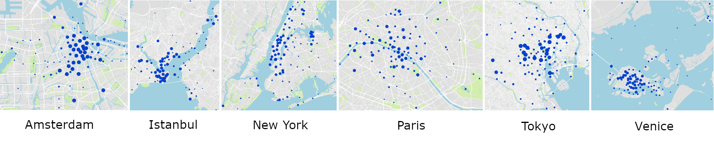

# YFCC100M-CITIES Photo Set
This dataset contains photo sets collected from publicly available [YFCC100M](http://projects.dfki.uni-kl.de/yfcc100m/) dataset. 

The photographs are selected from 6 different cities namely Amsterdam, Istanbul, New York, Paris, Tokyo and Venice which are among the most visited cities around the world.

There are totally 132K images collected from 323 users and 1.5K photo albums. The meta-data of photos such as geolocation, textual tags and timestamp are also available.

| City Albums | Number of Users | Number of Photo Sets | Number of Photos |
|-------------|:---------------:|:--------------------:|:----------------:|
| Amsterdam   | 39              | 100                  | 9923             |
| Istanbul    | 58              | 167                  | 13645            |
| New York    | 54              | 428                  | 30443            |
| Paris       | 39              | 178                  | 21819            |
| Tokyo       | 71              | 514                  | 36787            |
| Venice      | 62              | 179                  | 19729            |
| **Total**   | **323**         | **1566**             | **132346**       |

## How To Download

You can download the csv files containing the urls and meta-data of individual photos [here](./yfcmmf00m-cities.zip). The urls can be used to download photos from flickr.

# Summarization Photo Set
This dataset contains photo sets collected from Flickr.

There are 100 photos from 6 different cities namely Amsterdam, Istanbul, New York, Paris, Tokyo and Venice which are among the most visited cities around the world. These sets contain photos different than YFCC100M-CITIES.

| City Albums | Number of Photos |
|-------------|:----------------:|
| Amsterdam   | 100              |
| Istanbul    | 100              |
| New York    | 100              |
| Paris       | 100              |
| Tokyo       | 100              |
| Venice      | 100              |
| **Total**   | **600**          |

## How To Download

You can download the json files containing the urls and meta-data of individual photos [here](./summary-set.zip). The urls can be used to download photos from Flickr.
