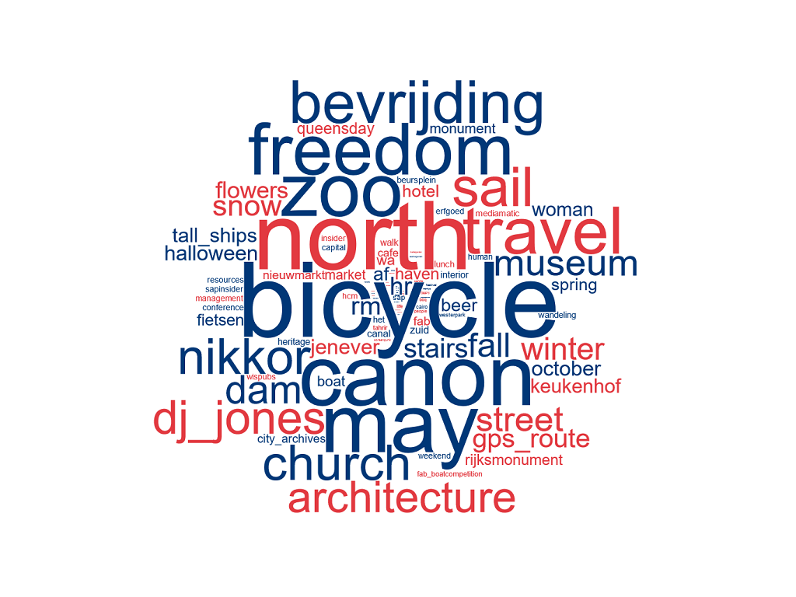
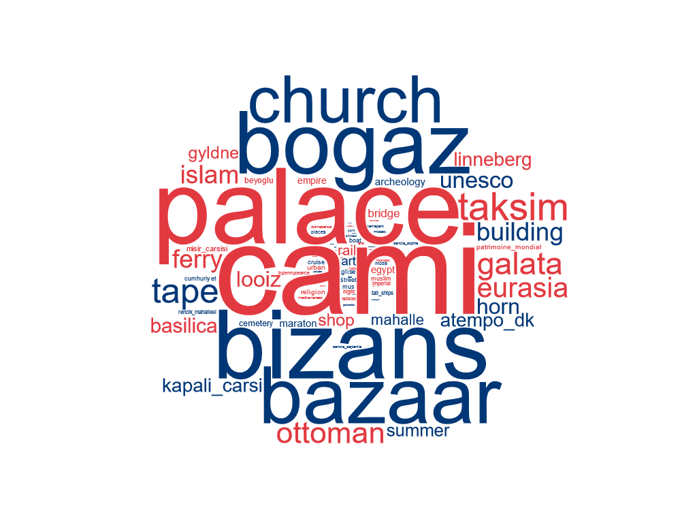

# YFCC100M-CITIES Photo Set
This dataset contains photo sets collected from publicly available [YFCC100M](http://projects.dfki.uni-kl.de/yfcc100m/) dataset. 

The photographs are collected as vacation photo collections from individual users visited 6 different cities namely Amsterdam, Istanbul, New York, Paris, Tokyo and Venice which are among the most visited cities around the world. Each set contains photos from a single user. Photos are scattered over the city covering as much locations as possible, as it can be seen on the figure where photos are tagged by their gps coordinates.

There are totally 132K images collected from 323 users and 1.5K photo albums. The meta-data of photos such as geolocation, textual tags and timestamp are also available.

| City Albums | Number of Users | Number of Photo Sets | Number of Photos | Number of Unique Words
|-------------|:---------------:|:--------------------:|:----------------:|:----------------:|
| Amsterdam   | 39              | 100                  | 9923             |1460|
| Istanbul    | 58              | 167                  | 13645            |979|
| New York    | 54              | 428                  | 30443            |18538|
| Paris       | 39              | 178                  | 21819            |1521|
| Tokyo       | 71              | 514                  | 36787            |4007|
| Venice      | 62              | 179                  | 19729            |2032|
| **Total**   | **323**         | **1566**             | **132346**       |**25118**|

For each city, textual data extracted from the photos' meta-data - which are tags and title - is also provided in terms of a word vocabulary and it's inverse-document frequencies. Additionally number of tags for each photo together with their term frequencies are also provided.
Amsterdam                    |  Istanbul
:---:|:---:
|

## How To Download

You can download the csv files containing the urls and meta-data of individual photos, word vocabulary and corresponding tf-idf values [here](./yfcmmf00m-cities.zip). Each csv file contains urls and meta-data of an individual user's photo collection from that specific city. The urls can be used to download photos from Flickr.

# Summarization Photo Set
This dataset contains photo sets collected from Flickr. Different from the YFCC100M-CITIES dataset, the photos are fetched directly from Flickr, on a ranged timescale and each city from a different individual user.

There are 100 photos from 6 different cities namely Amsterdam, Istanbul, New York, Paris, Tokyo and Venice which are among the most visited cities around the world. These sets contain photos different than YFCC100M-CITIES.

| City Albums | Number of Photos |
|-------------|:----------------:|
| Amsterdam   | 100              |
| Istanbul    | 100              |
| New York    | 100              |
| Paris       | 100              |
| Tokyo       | 100              |
| Venice      | 100              |
| **Total**   | **600**          |

## How To Download

You can download the json files containing the urls and meta-data of individual photos [here](./summary-set.zip). The urls can be used to download photos from Flickr.
